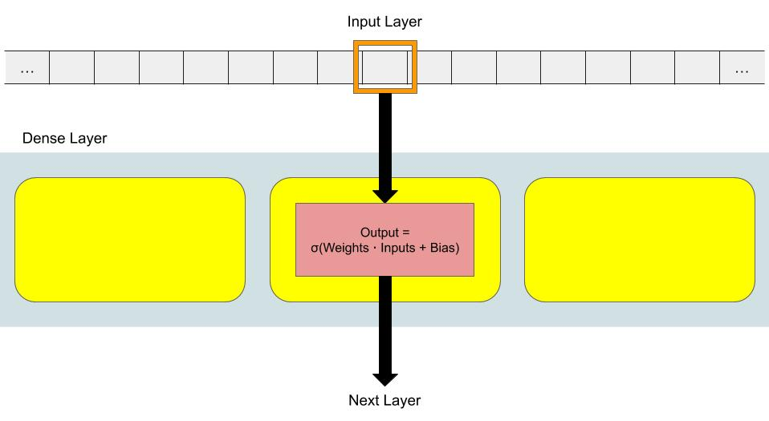
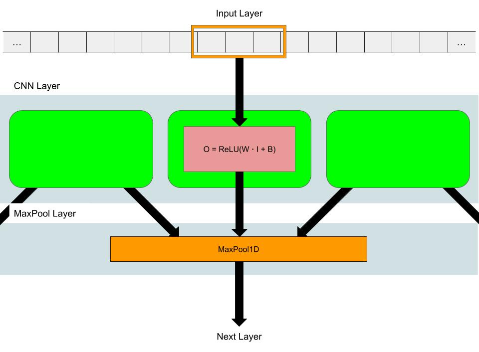
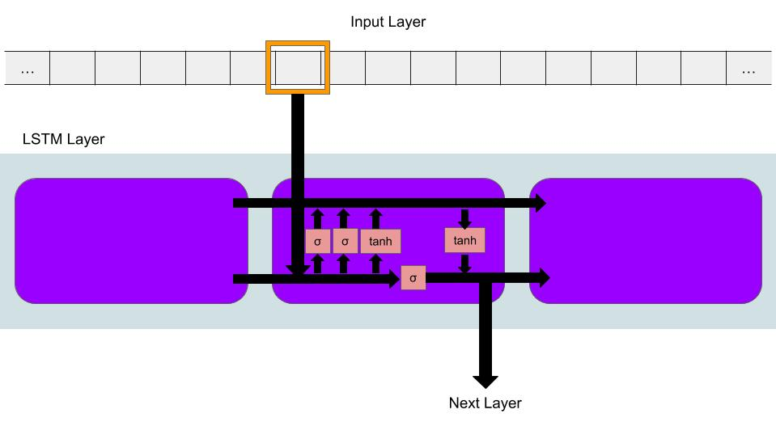
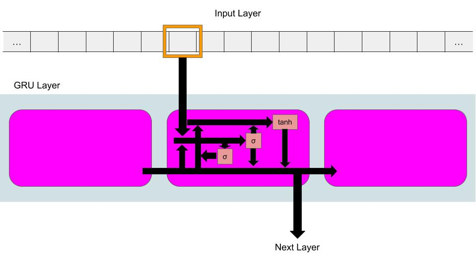
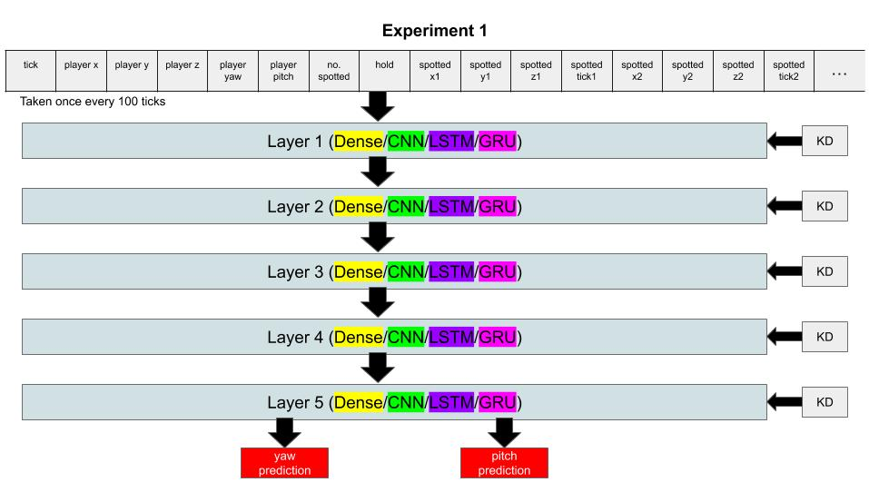
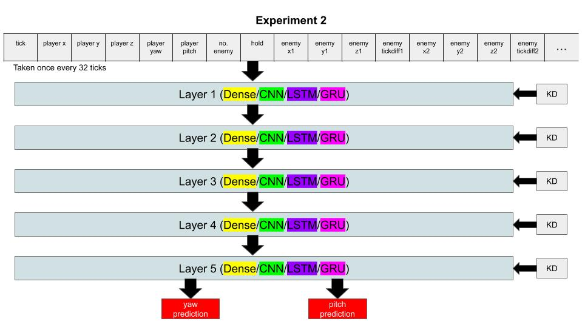
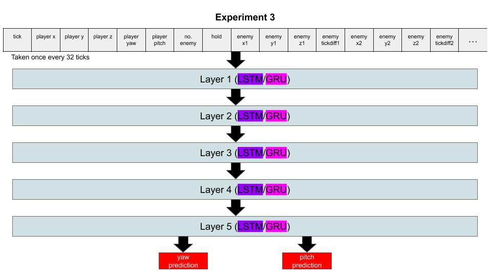
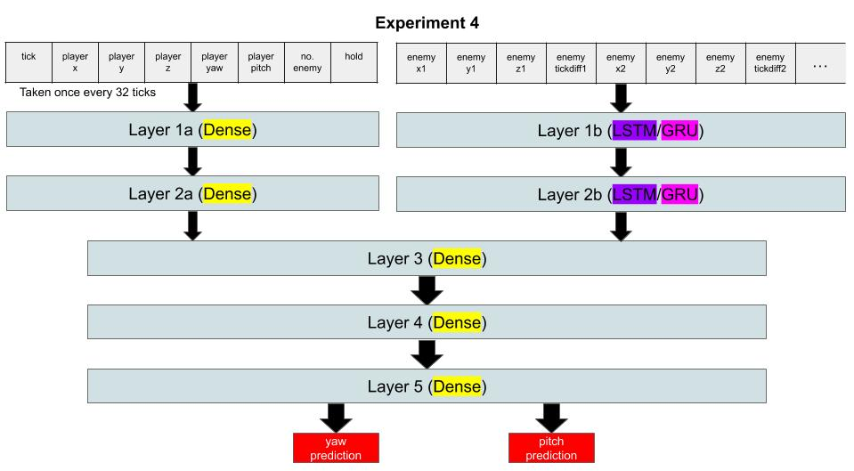

# CSAI
## Project Members
Koh Luck Heng, Gerrard Tai
- [Video Presentation](https://youtu.be/PmsJ2kOf1VQ)
- [GitHub Repo](https://github.com/flyyee/csai/tree/master)

## Project Introduction
CSAI is a program aided by machine learning that helps new Counter-Strike Global Offensive, or CSGO, players with no Internet connection learn to play the game.

Most new players will pick up the necessary skills for playing by watching more experienced players play in the matches they are in, or from youtube videos. A big part of picking up the game is learning where to look. For beginners, CSGO can be extremely complicated, especially when learning the ins and outs of a map they have never seen before. They will not know where they should be looking at certain points of the game in expectation of an enemy, at the entrance to their left, or the stairway by their right. Usually, they would amass such knowledge through watching more experienced players play - something they are unable to do when they have no Internet. Thus, CSAI was born of such noble intentions of providing knowledge to the world.

When playing a CSGO match, the user starts CSAI. At the press of a key, CSAI is fired up, reading information about the user’s current state in the game. The information it sends to the neural network are the user’s current position in the map, where he is currently looking and the positions his team has spotted enemies in that round. The neural net processes this, and returns the ideal position the user should be looking at. The program then shifts the user’s crosshair to face that position. In this fashion, CSAI takes into account all this data and uses machine learning to teach new players how to improve on the game.

## Machine Learning Algorithm
As stated earlier, information related to the current state of the game, such as the player’s current position on the map, the direction that he is looking at and the positions of the enemies spotted by his team, are sent to the neural network.

For our machine learning algorithm, we experimented with 4 different types of neural network layers

The first type is the dense layer, which is a basic layer with each cell having just one filter, where the inputs to the cell are evaluated using weights and biases that are changed depending on how far the output prediction deviates from the target value. The outcome of the calculation then passed into an activation function, usually either the `sigmoid`, `tanh` or `ReLU` functions, which serve to regulate the outputs of the cell which will be passed on to the next layer. For the dense layer, this activation function is the `sigmoid` function, which is defined as:
```
σ(x) = 1/[1+e^(-x)]
```


The second type is the convolutional neural network, or CNN. This network is different from the default dense layer as groups of neighbouring inputs will be passed into each filter, such that related information will be processed together. Here, the activation function used is the `ReLU` function, which will only return the input if it is more than 0:
```
ReLU(x) = max(0,x)
```
Usually, the CNN layer would be followed by a MaxPool layer, which will take the maximum of the outputs of adjacent CNN cells so as to reduce the effect of noise or small changes to the input data. CNNs are commonly used for image classification as regions of the image can be processed together.


The third type of model is the Long-Short Term Memory model, or LSTM. This is a type of Recurrent Neural Network, where the results of the evaluation in one cell is passed on to the next, therefore causing earlier information processed to affect later operations. For LSTM, there is another memory path for information to pass on from cell to cell, which facilitates information storage within the LSTM layer. Furthermore, it has 3 more filters to regulate the information that is passed on between cells, namely:
- The forget gate, which prevents unimportant information to be passed on to the next cell
- The input gate, which determines the information to be passed on in the memory path of the LSTM layer
- The output gate, which determines the information to be passed on to the next cell

The aforementioned additional filters all use the `sigmoid` activation function. However, the original RNN filter now uses the `tanh` activation function, which is defined as
```
tanh(x) = [e^x-e^(-x)]/[e^x+e^(-x)]
```


Last but not least, we have the Gated Recurrent Unit, GRU. This layer ditches the additional memory path and condenses some of the filters of the LSTM such that less operations need to be made, speeding up evaluation time. Therefore, the filters in the GRU layer are:
- The reset gate, which combines the functionality of the forget gate and input gate of the LSTM and decides what new information to discard and add. The activation function used is the `sigmoid` function.
- The update gate, which is another gate to decide how much past information to forget. The activation function used is the `sigmoid` function
- The original RNN filter which uses the `tanh` activation function



The four models are chosen as they are some of the more common neural network models used today. In particular, we predicted that the LSTM and GRU would be useful since they would be able to remember previous evaluations, which will be helpful when processing the enemies spotted data.

After the evaluation, the neural network returns two values: the ideal yaw and pitch values that the player should be facing in that situation.

## Dataset and Features
To get the inputs we wanted to train the models with, we had to generate our own as we were one of the first to look into combining machine learning with CSGO, and definitely the first to do it in such a fashion. As such, we downloaded 25 demo files of professional CSGO matches from the website hltv.org. They were the 25 most recent demo files on the map `de_dust2`.

Each demo file is essentially a copy of the match that can be replayed, containing the state of the environment and each player, such as what they have seen, their health, et cetera. As the demo files records the match to the finest detail, they provided us with all the information we needed to train our model, which is why we decided to use them to create our dataset.

Each demo has around 1 hour of gameplay, and there are either 64 ticks or 128 ticks in every second of gameplay. Each tick is essentially a single clock cycle in which the game engine processes and updates the state of the game. So to speak, the physics and interactions of the game are calculated 64 or 128 times every second.

Using the node.js module demofile, we recorded down the information we would be using as inputs for training the model every tick and for each of the 10 players in the demo, providing us with roughly 70 million data points. All the data is stored in comma-separated files that are marked by each player’s unique game identifier and their kills to death (KD) ratio.
```js
// writes game state to text file after every tick
// in demo_parser/app.js

demo_file.on("tickend", e => {
    if (showtick) {
        clog(e)
        showtick = false
        stillrunning = true
    }
    if (roundstart) {
        for (let x = 0; x < demo_file.entities.players.length; x++) {
            let pl = demo_file.entities.players[x]
            if (pl.steam64Id == 0) { // ignores invalid ids
                continue
            }
            if (pl.teamNumber == 0 || pl.teamNumber == 1) { // ignores spectators
                continue
            }

            if (pl.isSpotted) {
                if (pl.teamNumber == 2) {
                    // terrorist, add to list of spots made by ct
                    for (let c = 0; c < spottedListCTtemp.length; c++) {
                        if (spottedListCTtemp[c][1] === pl.placeName) {
                            spottedListCTtemp.splice(c, 1)
                        }
                    }
                    spottedListCTtemp.push([e, pl.placeName, pl.position])
                } else {
                    // counter terrorist, add to list of spots made by t
                    for (let c = 0; c < spottedListTtemp.length; c++) {
                        if (spottedListTtemp[c][1] === pl.placeName) {
                            spottedListTtemp.splice(c, 1)
                        }
                    }
                    spottedListTtemp.push([e, pl.placeName, pl.position])
                }
            }
        }

        // merges duplicate spots
        for (let newSpot of spottedListCTtemp) {
            for (let c = spottedListCT.length - 1; c >= 0; c--) {
                if ((newSpot[0] - spottedListCT[c][0]) < 257) {
                    // duplicate spot less than 4 seconds ago
                    if (spottedListCT[c][1] == newSpot[1]) {
                        spottedListCT.splice(c, 1)
                    }
                } else {
                    break
                }
            }
        }
        spottedListCT.push(...spottedListCTtemp)
        spottedListCTtemp = []
        for (let newSpot of spottedListTtemp) {
            for (let c = spottedListT.length - 1; c >= 0; c--) {
                if (newSpot[0] - spottedListT[c][0] < 257) {
                    if (spottedListT[c][1] === newSpot[1]) {
                        spottedListT.splice(c, 1)
                    }
                } else {
                    break
                }
            }
        }
        spottedListT.push(...spottedListTtemp)
        spottedListTtemp = []

        for (let x = 0; x < demo_file.entities.players.length; x++) {
            let pl = demo_file.entities.players[x]
            if (pl.steam64Id == 0) {
                continue
            }
            if (pl.teamNumber == 0 || pl.teamNumber == 1) {
                continue
            }
            let outputdata = `tick${e}\n${pl.position.x},${pl.position.y},${pl.position.z}\n${pl.eyeAngles.pitch},${pl.eyeAngles.yaw}\n`
            if (pl.teamNumber == 2) {
                // terrorist
                outputdata += `spotted${spottedListT.length}\n`
                if (bombplant) {
                    // holding
                    outputdata += "hold1\n"
                } else {
                    // not holding
                    outputdata += "hold0\n"
                }
                for (let spot of spottedListT) {
                    outputdata += '' + spot[2].x + "," + spot[2].y + "," + spot[2].z + "," + spot[0] + "\n"
                }
            } else {
                // ct
                outputdata += `spotted${spottedListCT.length}\n`
                if (bombplant) {
                    // not holding
                    outputdata += "hold0\n"
                } else {
                    // holding
                    outputdata += "hold1\n"
                }
                for (let spot of spottedListCT) {
                    outputdata += '' + spot[2].x + "," + spot[2].y + "," + spot[2].z + "," + spot[0] + "\n"
                }
            }

            fs.appendFile(`./results/${fname},results/${fname},${pl.steam64Id},${kds[pl.steam64Id]}`, outputdata, function (err) {
                if (err) {
                    fs.writeFile(`./results/${fname},results/${fname},${pl.steam64Id},${kds[pl.steam64Id]}`, outputdata, function (err) {
                        if (err) throw err;
                    })
                }
            })
        }

    }


    if (roundend) { // resets variables for the list of spotted players
        spottedListCT = [], spottedListT = []
    }

})
```

The structure of the inputs to the neural network are as follows:
- The first 8 columns of data contain the players own information
  - The number of ticks elapsed after the start of the match
  - The player’s x-coordinate
  - The player’s y-coordinate
  - The player’s z-coordinate
  - The player’s yaw (horizontal angle of sight)
  - The player’s pitch (vertical angle of sight)
  - Number of enemies spotted by the team
  - Whether the player’s team is attacking or defending
- The other columns contain information about the enemies that are spotted by the player’s team. As the neural network only accepts a fixed number of inputs, we had to fix the number of enemy data to 15 sets, truncating off extra sets of data and padding the columns with zeroes if the data is insufficient. Each set of enemy data consists of
  - The enemy’s x-coordinate when spotted
  - The enemy’s y-coordinate when spotted
  - The enemy’s z-coordinate when spotted
  - The number of ticks elapsed after the start of the game when the enemy was spotted
  - The target values, on the other hand, would be the player’s yaw and pitch values at the next datapoint.

An example of 1 datapoint on our dataset:
```
tick116863
1701.1904296875,997.8906860351562,1.9261016845703125
3.4002685546875,157.12646484375
spotted6
hold1
-2009.73876953125,1518.663818359375,87.60804748535156,102993
334.4256591796875,1617.818603515625,6.078970909118652,112577
334.4256591796875,1617.818603515625,6.078970909118652,112613
894.9175415039062,2470.05859375,160.48446655273438,112679
595.3279418945312,2594.00244140625,95.53994750976562,114295
595.138427734375,2592.861572265625,95.56367492675781,114369
```

Afterwards, a Python program reads the data from the text file into numpy arrays to be fitted into the models
```py
# loading demo information from text files at Python side
# in nn_training/load_data.py

def load_demo(demofiles, tick_diff=32):
    """Writes demo information from text files into numpy arrays for easy input into the model"""
    feature_lst = []; target_lst = []; weight_lst = []
    for demofn in demofiles:
        kd = float(demofn[-4:].replace(",", ".")) # get kd ratio from filename for weights
        # read and clean data from text files
        with open("./demofiles/{}".format(demofn)) as demofile:
            textdata = demofile.read()
        prev_tick = float(textdata.split("\n")[0].replace("tick", "")) - (tick_diff+1)
        textdata = textdata.replace("\n", ",")
        textdata = textdata.replace(",tick", "\n")
        textdata = textdata.replace("spotted", "").replace("hold", "").replace("tick", "")
        curr_feature_lst = []; curr_target_lst = []
        for line in textdata[:-1].split("\n"):
            linedata = list(map(float, line.split(",")))
            # if datapoints are within 32 ticks of each other, move on to next tick
            if (linedata[0] - prev_tick < tick_diff):
                continue
            # pad and trim list of features such that there are 15 sets of enemy data
            prev_tick = linedata[0]
            rem_len = len(linedata)-8
            if rem_len < SPOTTED_CAP*4:
                 linedata.extend([0.0]*(SPOTTED_CAP*4-rem_len))
            curr_feature_lst.append(linedata[:8] + spotted_tick_diff(linedata[0], linedata[-SPOTTED_CAP*4:]))
            curr_target_lst.append(linedata[4:6])
            weight_lst.append(kd)
        # offset list of features and list of targets
        # such that the targets for each input is the pitch and yaw of the next datapoint
        curr_feature_lst.pop(); curr_target_lst.pop(0); weight_lst.pop()
        # add current list of features and targets into overall list
        feature_lst += curr_feature_lst
        target_lst += curr_target_lst
        print("Loaded demo {} with {} sets of data".format(demofn, len(curr_feature_lst)))
    # ensure that the total number of datapoints is a multiple of 3
    # to accomodate the batch size of 3 during training
    while len(feature_lst) % 3 != 0:
        feature_lst.pop(); target_lst.pop(); weight_lst.pop()
    # transpose numpy arrays to accomodate structure of input layer
    features = np.transpose(np.array(feature_lst))
    targets = np.transpose(np.array(target_lst))
    weights = np.array(weight_lst)
    return features, targets, weights
```

## Machine Learning Development
To code our models, we used the tensorflow machine learning library, which comes with many built-in optimised neural network models that we can use.

In creating our model, we used the `tf.keras.Model` object since it contains specialised functions for compilation, fitting, evaluation and prediction, simplifying the building and training process of our models. Using the aforementioned object, each new layer would be linked to previous layers like this:
```
new_layer = <tf.keras.layer object>(params)(prev_layer)
```
As seen in the snippet below, the preprocessing layer and main neural network layers are defined with functions that can be customised, while the output of the main neural network layer will be passed into 2 branches of 1 dense layer each, the outputs from which being the final predictions for the yaw and pitch values. The `tf.keras.Model` object is then initialised with the list of inputs (from the preprocessing layer) and list of outputs (yaw and pitch outputs from the 2 dense layer branches).
```py
# initialising the model
# in nn_training/keras_model.py

# create model layers
self.inputs, self.preprocess = self.build_preprocess()
self.core_layers = self.create_model()
self.yaw_output = tf.keras.layers.Dense(1, name="target_yaw")(self.core_layers)
self.pitch_output = tf.keras.layers.Dense(1, name="target_pitch")(self.core_layers)
# initialise model with created layers
self.model = tf.keras.Model(
    inputs=self.inputs,
    outputs=[self.yaw_output, self.pitch_output],
    name=self.name
)
```

The preprocessing layer is simply a list of `tf.keras.layers.Input` objects, one for each of the 68 inputs mentioned above.
```py
# general preprocessing layer
# in nn_training/keras_model.py

def build_preprocess(self):
      """Input layer for the model"""
      columns = [tf.keras.layers.Input(shape=1, name=title) for title in INPUT_COLS] # 1 input layer for each piece of data
      concatenated = tf.keras.layers.concatenate(columns) # merge input layers together
      # Returns list of input layers and the reshaped concatenated input layer
      # Former is used in initialisation of the model
      # Latter is used to pass to the next layer (main nn layer)
      return columns, tf.reshape(
          concatenated,
          tf.constant([self.batch_size, self.steps, len(columns)])
      )
```

For the main neural network layers, we stringed the relevant built-in keras layers provided by tensorflow back-to-back. We used 5 layers of each neural network model for our training, though it is possible for us to specify a different number of layers for this function. Listed below are the keras layers used for each of the types of models we experimented with.
- Dense: `tf.keras.layers.Dense`
- CNN: `tf.keras.layers.Conv1D`, `tf.keras.layers.Dropout` & `tf.keras.layers.MaxPool1D`
- LSTM: `tf.keras.layers.LSTM`
- GRU: `tf.keras.layers.GRU`

```py
# main neural network layers for dense model
# other models are defined in similar ways
# in nn_training/keras_model.py

def create_model(self):
      """Main neural network layer for the model"""
      prev_layer = self.preprocess
      # pipe outputs of previous layer into the new layer
      for _ in range(self.nlayers):
          new_layer = tf.keras.layers.Dense(
              self.units,
              activation=self.activation
          )(prev_layer)
          prev_layer = new_layer
      # return the last layer to be piped into output dense layers
      return prev_layer
```

As we created a different branched model for our 4th experiment, we needed to change up the formats of the preprocessing and neural network layers. The inputs for the player information and spotted enemy information was split up, while the two branches had to be defined separately before being concatenated at a later layer.
```py
# preprocessing layer for branched model
# in nn_training/branched_model.py

def build_preprocess(self):
      # initialise input layers for player information and enemy information separately
      player_cols = [tf.keras.layers.Input(shape=1, name=title) for title in INPUT_COLS[:8]]
      spotted_cols = [tf.keras.layers.Input(shape=1, name=title) for title in INPUT_COLS[8:]]
      # pass in 2 different sets of input layers for initialisation and later layers
      return [player_cols, spotted_cols], [
          tf.reshape(tf.keras.layers.concatenate(player_cols), tf.constant([self.batch_size, self.steps, len(player_cols)])),
          tf.reshape(tf.keras.layers.concatenate(spotted_cols), tf.constant([self.batch_size, self.steps, len(spotted_cols)])),
      ]
```
```py
# main neural network layers for branched model
# in nn_training/branched_model.py

def create_model(self):
      player_prev, spotted_prev = self.preprocess
      for _ in range(self.combine_at):
          # processing of player information with Dense layers
          player_layer = tf.keras.layers.Dense(
              self.units,
              activation=self.activation_dense,
          )(player_prev)
          player_prev = tf.keras.layers.Dropout(self.dropout)(player_layer)

          # processing of enemy information with RNN layers (set to GRU by default)
          spotted_layer = \
              tf.keras.layers.GRU(
                  self.units,
                  activation=self.activation_rnn,
                  return_sequences=True
              )(spotted_prev) if self.spotted_branch == "GRU" else \
              tf.keras.layers.LSTM(
                  self.units,
                  activation=self.activation_rnn,
                  return_sequences=True
              )(spotted_prev) if self.spotted_branch == "LSTM" else \
              tf.keras.layers.SimpleRNN(
                  self.units,
                  activation=self.activation_rnn,
                  return_sequences=True
              )(spotted_prev)
          spotted_prev = tf.keras.layers.Dropout(self.dropout)(spotted_layer)

      # combine the evaluation of player information and enemy information
      combined_prev = tf.keras.layers.concatenate([player_prev, spotted_prev])
      for _ in range(self.nlayers-self.combine_at):
          # processing of combined information with Dense layers
          combined_layer = tf.keras.layers.Dense(
              self.units,
              activation=self.activation_dense,
          )(combined_prev)
          combined_prev = tf.keras.layers.Dropout(self.dropout)(combined_layer)
      # return the last layer to be piped into output dense layers
      return combined_prev
```

When using the model for prediction, the inputs also have to be preprocessed first by trimming the enemy spotted data if there are more than 15 sets of it, or by padding the enemy spotted data if there is less.
```py
# prediction with the model
# in nn_training/keras_model.py

def predict(self, inputs, spotted_cap=15, **kwargs):
      """
      Prediction with the model
      Inputs should be a list of lists of shape
      [tick, self_x, self,y, self_z, self_yaw, self_pitch, spotted, hold, p1_x, p1_y, p1_z, p1_tick, p2_x, ...]
      It will cap out at 15 values for the other spotted players
      """
      # pad and trim list of features such that there are 15 sets of enemy data
      rem_len = len(inputs)-8
      zeroes = array([0.0]*len(inputs[0]))
      while rem_len < spotted_cap*4:
          inputs.append(zeroes)
          rem_len += 1
      inputs = inputs[:8] + inputs[-spotted_cap*4:]
      # pass game state into the model
      predictions = self.model.predict(
          {title: inputs[i] for i, title in enumerate(INPUT_COLS)},
          batch_size=self.batch_size,
          **kwargs
      )
      # return 1 set of [yaw, pitch] for each datapoint
      return transpose(predictions)[0][0]
```

Although the `tf.keras.Model` object has already greatly condensed the development process, we still found that there was a steep learning curve as we had little knowledge about manipulating tensors, and found the documentation and error messages difficult to read. Hence, the debugging process involved quite a lot of trial and error based on suggested code snippets from Stack Overflow

## Training Experiments and Results
For our first experiment, we fed all of our inputs through 5 layers of each model type. Due to limited preprocessing, we fed in the ticks where each enemy was spotted, instead of the time difference between the current tick and the tick where the enemy is spotted. We also used the kd ratio of each match as supplementary weights to the evaluation.


In the second experiment, we improved our preprocessing bit by feeding the time difference between the current tick and the tick when the enemy is spotted into our model, as well as only taking spotted enemy players into account. We also decreased the tick interval of our data from 100 ticks to 32 ticks such that more data points are used to train our models.


In the third experiment, we decided to exclude the kd ratio as we figured that since we are already using data from professional players, there wasn’t much need to differentiate between their proficiency. We also decided to stop training the dense and CNN models since we felt that
- The Dense layer was too simple
- The CNN layer would probably take into account of information that belonged to different sets of enemy data, therefore possibly confusing the model by allowing it to associate unrelated sets of data
- The LSTM and GRU would be more suited for the nature of our dataset.



For our fourth experiment, we decided to first evaluate the player information and spotted enemy information separately, before merging them in a later layer. Here, we only used the RNN models to evaluate the spotted enemy information – since this is where the memory functions of RNNs are most important – while dense layers are used in other parts.


Each experiment was trained for 10 epochs.

Unfortunately, we have not been able to get a satisfactory accuracy value for all 4 of our experiments. However, the accuracy of 0% is not completely representative of the accuracy of the model’s outputs. This is because the eye angle pitch and yaw values the model outputs do not have to completely match the correct pitch and yaw values, but rather just be in the same region. For example, an output pitch and yaw value that deviates from the correct output we provide it by just 1pixel would be deemed as incorrect and affect the accuracy, but such precision is realistically unnecessary. As the pitch and yaw values are also floating point integers, it is unlikely that they would match exactly, leading to this phenomenon.

Since all of our demo files are retrieved from matches in the same map, it can be quite certain that our models are probably overfitted to the layout of the map. However, we thought about this before and decided to go ahead with this since we figured that it would have been difficult for us to load all of the necessary demo files for our model to be able to play on multiple CSGO maps and even if we managed to do that, we fear that the differences between the maps would only confuse our model. If we were to expand our project to work on other CSGO maps in the future, we would probably have to train different models for each of the maps such that the predictions made would be more specialised.

## Application Deep Dive
Now, onto the implementation of the application side, which is how we obtained information about the player the user is controlling in CSGO. Our application reads this information directly from the memory of CSGO. The application is written in C++.

The C++ program is constantly reading CSGO’s memory and extracting information, and is also waiting for the F5 key to be pressed. The key F5 was used as it is one of the few keys not used in CSGO, for example the WASD keys are taken up by CSGO for movement. The program first locates the address of memory the CSGO client and engine are using. Then using pre-determined constants that represent an amount to travel in memory, known as offsets, we added the offsets to the base address of the CSGO client or engine, depending on what variable we were looking for. Then, located at that position in memory would contain the variable represented by that specific offset. Using this, we obtained the user’s x, y and z coordinates in the map, the pitch and yaw of his view angle and the list of positions the enemies had been at when his team spotted them. This list of positions the enemies had been spotted in has to be constantly compiled and added to, which is what the program is doing in the background, while the rest of the information can be checked at the instant of the key press.
```cpp
// function to locate memory addresses of client and engine
// in MemoryManager.h

MODULEENTRY32 GetModule(const char* ModuleName) {
  // locate memory address of client and engine modules
  HANDLE hModule = CreateToolhelp32Snapshot(TH32CS_SNAPMODULE, dwPID);
  MODULEENTRY32 mEntry;
  mEntry.dwSize = sizeof(mEntry); // size of module entry

  const WCHAR* modNameChar;
  int nChars = MultiByteToWideChar(CP_ACP, 0, ModuleName, -1, NULL, 0);
  modNameChar = new WCHAR[nChars];
  MultiByteToWideChar(CP_ACP, 0, ModuleName, -1, (LPWSTR)modNameChar, nChars);

  do // looks for csgo module
    if (!wcscmp(mEntry.szModule, modNameChar))
    {
      CloseHandle(hModule);
      return mEntry;
    }
  while (Module32Next(hModule, &mEntry));

  CloseHandle(hModule);
  mEntry.modBaseAddr = 0x0;
  return mEntry;
}
```
```cpp
// waiting for F5 and reading information from memory
// in main.cpp

while(!stopFlag) {
  if (GetAsyncKeyState(VK_F5)) {
    //Retrieve player information
    LocalPlayer_Base = Mem->Read<DWORD>(Mem->ClientDLL_Base + dwLocalPlayer);
    myTeamId = Mem->Read<int>(LocalPlayer_Base + m_iTeamNum);
    myEyePitch = Mem->Read<float>(LocalPlayer_Base + m_angEyeAnglesX);
    myEyeYaw = Mem->Read<float>(LocalPlayer_Base + m_angEyeAnglesY);
    myPosX = Mem->Read<float>(LocalPlayer_Base + m_vecOrigin);
    myPosY = Mem->Read<float>(LocalPlayer_Base + m_vecOrigin + 0x4);
    myPosZ = Mem->Read<float>(LocalPlayer_Base + m_vecOrigin + 0x8);
    std::cout << "Eye angles: " << myEyePitch << " " << myEyeYaw << std::endl;
    std::cout << "Position: " << myPosX << " " << myPosY << " " << myPosZ << std::endl;

    currentTime = GetTickCount() - startTime;
    currentTick = currentTime / 1000 * 64;

    std::cout << "Current tick: " << currentTick << std::endl;

    Grp_Base = Mem->Read<DWORD>(Mem->ClientDLL_Base + dwGameRulesProxy);
    bombPlanted = Mem->Read<bool>(Grp_Base + m_bBombPlanted);
    hold = false;
    if (myTeamId == 2) {
      // terrorist
      hold = (bombPlanted ? true : false);
    }
    else if (myTeamId == 3) {
      // CT
      std::cout << bombPlanted;
      hold = (bombPlanted ? false : true);
    }
```

Upon detecting the keypress by the user, the C++ program pipes the information to the Python neural network by appending the information as comma-separated values to a file, with the tag of “input” and adding on the time elapsed from the start of the game. The C++ then enters a time-limited loop to wait for a similar output by the neural network to the file.
```cpp
// writing inputs to the model in text file
// in main.cpp (cont'd from previous c++ snippet)

  std::string fileInput = "\n";
  fileInput += "input," + std::to_string(currentTick) + ",";
  fileInput += std::to_string(currentTick) + "," + std::to_string(myPosX) + "," + std::to_string(myPosY) + "," + std::to_string(myPosZ) + ",";
  fileInput += std::to_string(myEyePitch) + "," + std::to_string(myEyeYaw) + ",spotted" + std::to_string(spottedList.size()) + ",hold" + (hold ? "1" : "0");

  for (auto& spot : spottedList) {
    fileInput += "," + std::to_string(spot.posX) + "," + std::to_string(spot.posY) + "," + std::to_string(spot.posZ) + "," + std::to_string(spot.tick);
  }
  fileInput += "\n";
  std::cout << fileInput << std::endl;

  std::fstream myfile;
  myfile.open(inputFN, std::ios_base::app);
  myfile << fileInput;
  myfile.close();
  // write to file the input to the ai
```

The Python program will be repeatedly checking the file for a relevant new line, indicated by an “input” tag and a timestamp that is later than what was previously recorded. If both criteria are met, the Python program will read the new information sent to it and input it to the neural network for prediction. After processing the inputs, the neural net outputs the ideal pitch and yaw for the user given all the information, which will be sent back to the C++ program in the same file, but with the “output” tag instead.
```py
# main python program loop
# in main.py

prev_timestamp = 0
start_time = int(round(time.time() * 1000))
model = load_model(MODEL_FN) # load the model
# continuously checks for input by csgo helper
while True:
    status = ""; timestamp = prev_timestamp
    # reads game state from shared file with the csgo helper
    while status != "input" or int(timestamp) <= prev_timestamp: # check if line type is input and timestamp is different
        with open(IO_FN) as inputfile:
            last_line = inputfile.readlines()[-1].strip().split(",")
        status, timestamp = last_line[:2]
    strdata = last_line[2:]
    # cleans data to be passed into the neural network
    strdata[6] = strdata[6][7:]; strdata[7] = strdata[7][4:]
    data = [array([float(d), 0.0, 0.0]) for d in strdata]
    new_yaw, new_pitch = model.predict(data)[0] # pass game state into neural network
    # writes ideal pitch and yaw to shared file with csgo helper
    new_timestamp = int(round(time.time() * 1000)) - start_time
    with open(IO_FN, "a") as outputfile:
        outputfile.write("output,{},{},{}\n".format(
            new_timestamp,
            mod360(new_yaw),
            mod360(new_pitch)
        ))
```

Therefore in general, the lines of the file would be of the format `"input"/"output",timestamp,data` where `data` is basically a list of values that consists of
- Input: the same 8 values indicating the player’s information, and the 15 sets of enemy information
- Output: predictions for ideal yaw and pitch

When the C++ program detects the new output information appended to the file, it performs a similar check before it reads the information and writes this ideal pitch and yaw to the game’s memory, gradually moving the user’s view angle to the right one at a modifiable speed. This speed cannot be too slow or the user will be stuck in the animation for too long. If it is too fast, the user will not be able to see how he should change his view angle in the future and will not learn from the program. As such, a good balance of speed is needed.
```cpp
// reading model outputs from text file
// in main.cpp (cont'd from previous c++ snippet)

  for (int pollFileCount = 0; pollFileCount < 15; pollFileCount++) {
    // continuously polls the file for 3 seconds to receive the output from the ai
    std::fstream myfile2;
    myfile2.open(inputFN);

    // reads the last line of the file
    myfile2.seekg(-1, std::ios_base::end);
    bool keepLooping = true;
    while (keepLooping) {
      char ch;
      myfile2.get(ch);
      if ((int)myfile2.tellg() <= 1) {
        myfile2.seekg(0);
        keepLooping = false;
      }
      else if (ch == '\n') {
        keepLooping = false;
      }
      else {
        myfile2.seekg(-2, std::ios_base::cur);
      }
    }

    std::string lastLine;
    std::getline(myfile2, lastLine);
    myfile2.close();

    int linePos1 = 0, linePos2 = 0;
    float outputPitch, outputYaw;
    linePos2 = lastLine.find(",");
    std::cout << lastLine << std::endl;
    if (lastLine.substr(linePos1, linePos2) == "output") { // checks if line type is output
      linePos1 = linePos2+1;
      linePos2 = lastLine.find(",");
      int newOutputTime = std::stoll(lastLine.substr(linePos1, linePos2 - linePos1));
      if (newOutputTime > lastOutputTime) { // checks if line was written after the last previous read
        lastOutputTime = newOutputTime;
        // move crosshair based on ideal yaw and pitch calculated by the ai
        linePos1 = linePos2+1;
        linePos2 = lastLine.find(",");
        outputPitch = std::stof(lastLine.substr(linePos1, linePos2 - linePos1));
        linePos1 = linePos2+1;
        outputYaw = std::stof(lastLine.substr(linePos1, lastLine.length() - linePos1));
        MoveXhair(outputPitch, outputYaw);
        break;
      }
    }
    Sleep(200);
  }
Sleep(200);
}
```
```cpp
// moving the user's view angle
// in main.cpp

void MoveXhair(float endPitch, float endYaw) { // moves player crosshair
	Sleep(1000);
	std::cout << "Moving Xhair..." << std::endl;
	bool stop = false;
	const float pitchSpeed = 0.2, yawSpeed = 0.2; // in degrees/ms
	// obtains time for measuring speeds and performing stop conditions
	DWORD startTime = GetTickCount();
	DWORD currentTimePitch, startTimePitch = GetTickCount();
	DWORD previousTimePitch = startTimePitch;
	DWORD currentTimeYaw, startTimeYaw = GetTickCount();
	DWORD previousTimeYaw = startTimeYaw;
	DWORD LocalPlayer_Base = Mem->Read<DWORD>(Mem->ClientDLL_Base + dwLocalPlayer); // information about the current player
	DWORD clientState = Mem->Read<DWORD>(Mem->EngineDLL_Base + dwClientState); // modifiable variables for the current player

	float myEyePitch = Mem->Read<float>(LocalPlayer_Base + m_angEyeAnglesX);
	float myEyeYaw = Mem->Read<float>(LocalPlayer_Base + m_angEyeAnglesY);
	int pitchDirection = 0, yawDirection = 0; // determines the direction in which to move the crosshair
	bool pitchComplete = false, yawComplete = false; // whether the movement is complete
	Vec3 eyeVec;
	eyeVec.x = myEyePitch, eyeVec.y = myEyeYaw, eyeVec.z = 0;

	if (myEyePitch == endPitch) {
		pitchComplete = true;
	}
	if (myEyeYaw == endYaw) {
		yawComplete = true;
	}
	if (myEyePitch > 90) {
		// converts pitch to range -90 to 90
		myEyePitch -= 360;
	}
	if (endPitch > 90) {
		endPitch -= 360;
	}
	if (myEyePitch > endPitch) {
		pitchDirection = -1;
	}
	else {
		pitchDirection = 1;
	}

	// yaw in range 0 to 360
	if (myEyeYaw > endYaw) {
		if ((myEyeYaw - endYaw) > 180) {
			yawDirection = -1;
		}
		else {
			yawDirection = 1;
		}
	}
	else {
		if ((endYaw - myEyeYaw) > 180) {
			yawDirection = 1;
		}
		else {
			yawDirection = -1;
		}
	}

	while (!pitchComplete || !yawComplete) {
		if ((GetTickCount() - startTime) > 3000) {
			// more than 3s elapsed since crosshair started moving
			break;
		}
		LocalPlayer_Base = Mem->Read<DWORD>(Mem->ClientDLL_Base + dwLocalPlayer);
		currentTimePitch = GetTickCount();

		if (!pitchComplete) {
			if (pitchDirection == -1) {
				if (myEyePitch <= endPitch) {
					pitchComplete = true;
				}
			}
			else {
				if (myEyePitch >= endPitch) {
					pitchComplete = true;
				}
			}
			myEyePitch += (currentTimePitch - previousTimePitch) * pitchSpeed * pitchDirection;
			if (myEyePitch > 89) {
				myEyePitch = 89;
				pitchComplete = true;
			}
			else if (myEyePitch < -89) {
				myEyePitch = -89;
				pitchComplete = true;
			}
			clientState = Mem->Read<DWORD>(Mem->EngineDLL_Base + dwClientState);
			eyeVec.x = myEyePitch;
		}
		previousTimePitch = currentTimePitch;

		currentTimeYaw = GetTickCount();
		if (!yawComplete) {
			if (yawDirection == 1) {
				// clockwise
				if (myEyeYaw < 0) {
					if ((myEyeYaw + 360) < endYaw) {
						if ((endYaw - myEyeYaw - 360) < 90) {
							yawComplete = true;
						}
					}
				}
				else {
					if (myEyeYaw < endYaw) {
						if ((endYaw - myEyeYaw) < 90) {
							yawComplete = true;
						}
					}
				}
			}
			else {
				// anticlockwise
				if (myEyeYaw < 0) {
					if ((myEyeYaw + 360) > endYaw) {
						if ((myEyeYaw + 360 - endYaw) < 90) {
							yawComplete = true;
						}
					}
				}
				else {
					if (myEyeYaw > endYaw) {
						if ((myEyeYaw  - endYaw) < 90) {
							yawComplete = true;
						}
					}
				}
			}
			myEyeYaw += (currentTimeYaw - previousTimeYaw) * yawSpeed * (-yawDirection);
			if (myEyeYaw < 0) {
				// modulo check
				myEyeYaw += 360;
			}
			if (myEyeYaw >= 360) {
				myEyeYaw -= 360;
			}
			if (myEyeYaw > 180) {
				myEyeYaw -= 360;
			}
			eyeVec.y = myEyeYaw;
		}
		previousTimeYaw = currentTimeYaw;
		Mem->Write<Vec3>(clientState + dwClientState_ViewAngles, eyeVec); // writes to game memory
	}

}
```

Hence, when beginners of CS:GO are aided by CSAI, they can quickly improve in their skills as shown [here](https://drive.google.com/file/d/1FR2UesLX9ZYXffmNu6an4r_hY3KW4BKN/view?usp=sharing).

## Team Effort
Gerrard:
- Retrieving demofiles
- C++ program to send information between CSGO and Python program

Luck Heng:
- Neural network development
- Python program to send information between neural network and C++ program

## Conclusion
This project has also wide-ranging applications. There is a wide market for designing CSGO cheats. CSAI can be further refined and developed upon, serving as the basis for CSGO cheats that have human-like cognition, creating a cheat that makes decisions the same way humans would. Comparing this with current cheats that follow a more mechanical approach in assisting the player, cheats based on CSAI would make detection by human viewers extremely difficult. While the ethics of such projects are questionable, it is a possible application for CSAI.

On the flip side, CSGO developers can also use the ideas behind CSAI to create bots that are more human-like. Bots serve as teammates and enemies in offline games, where online players are unavailable. This would serve to increase the immersion of the player. An extension of CSAI could also be the reverse of making cheats, being creating a better anti-cheat system. By understanding what sort of decisions in moving the view angle are human-like, actions by players whose mouse movements do not fit this human-like behaviour can be flagged for further checking of cheating.

Overall, this project has been extremely insightful in beginning research into possible applications of machine learning into teaching beginners in CSGO how to play the game. Working on CSAI has shed light into the world of applications interfacing with games and the core principles behind machine learning development. If we had a higher budget and more time, we would likely look into the following areas for improvement:
- Using cloud computing and better machines to increase our resources and decrease the training time
- Using larger and more diverse datasets in order to
  - Allow our model to group certain regions of the maps together
  - Train more models that will be able to work on different maps
  - Train specific models to mimic certain playstyles of professional players
- Creating custom neural network layers that are better able to process the data from the demofiles
